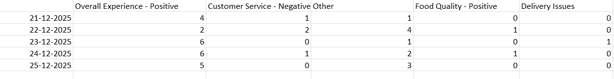

# Senior AI Engineer Assignment - Agentic AI System for Play Store Review Trend Analysis (MADHUMITHAA P - RA2211003040068)
## Problem Statement

Modern consumer applications receive thousands of Play Store reviews every day.  
Manually analyzing these reviews to identify **recurring issues, sentiment shifts, and topic trends over time** is inefficient and not scalable.

This project implements an **Agentic AI-based pipeline** that automatically:
- Extracts meaningful topics from raw user reviews
- Deduplicates semantically similar topics
- Tracks how topics evolve over time (T-30 → T)
- Generates a structured trend report for business and product teams

---

## Why Agentic AI?

Instead of a single monolithic script, the system is designed using **independent agents**, each responsible for a well-defined task.

### Benefits of this approach:
- Modular and extensible design
- Clear separation of responsibilities
- Production-grade architecture
- Easy debugging and maintenance

Each agent operates independently but contributes to a unified analytical pipeline.

---

## System Architecture

```
playstore-review-agent/
│
├── agents/
│   ├── ingestion_agent.py      # Review ingestion & preprocessing
│   ├── topic_agent.py           # Topic extraction & normalization
│   ├── dedup_agent.py           # Topic deduplication
│   ├── trend_agent.py           # Trend aggregation (T-30 → T)
│
├── utils/
│   ├── embeddings.py            # Text embedding utilities
│   └── taxonomy.py              # Topic normalization logic
│
├── data/
│   ├── raw/                     # Raw review inputs
│   └── processed/               # Cleaned intermediate data
│
├── output/
│   └── trend_report.csv         # Final trend analysis output
│
├── main.py                      # Pipeline orchestrator
├── requirements.txt
└── README.md
```

---

## Agent Responsibilities

| Agent | Description |
|-------|-------------|
| **Ingestion Agent** | Loads raw reviews and performs basic preprocessing |
| **Topic Agent** | Extracts topics and normalizes noisy review text |
| **Dedup Agent** | Merges semantically similar topics into unified categories |
| **Trend Agent** | Aggregates topic frequencies across time windows |

---

## Topic Normalization

Raw user reviews are often noisy and inconsistent.  
For example:
- "very poor service"
- "bakvas service"
- "worst experience"

These are normalized into business-friendly topics such as:
- **Customer Service – Negative**
- **Overall Experience – Negative**

This ensures the final output is **actionable** and easy to interpret by stakeholders.

---

## Output Description

The final deliverable is a CSV report:



```
output/trend_report.csv
```

### Report Structure:
- **Rows** → Normalized topics
- **Columns** → Dates (T-30 → T)
- **Cells** → Frequency of topic occurrence per day

This report can be directly used in:
- Excel / Google Sheets
- Dashboards
- Product and CX analysis

---

## How to Run the Project

### 1. Install dependencies
```bash
pip install -r requirements.txt
```

### 2. Run the pipeline
```bash
python main.py
```

### 3. Expected output
```
✅ Trend report generated
```

The generated CSV will be available in the `output/` folder.

---

## Tech Stack

- Python
- Scikit-learn
- Sentence embeddings
- CSV-based reporting

---

## Future Enhancements

- Sentiment intensity scoring
- Real-time streaming ingestion
- Dashboard-based visualization
- Multi-language review support

---

## Conclusion

This project demonstrates how Agentic AI systems can be used to convert unstructured customer feedback into structured, trend-based insights that support data-driven decision-making.

---

## Quick Start

1. Save this file as `README.md`  
2. Do **NOT** modify it unless asked  
3. Run:
```bash
python main.py

```


